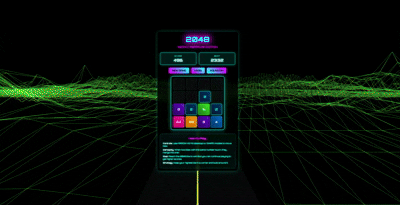

# 2048 Neon Cyberpunk

**Play Online: [2048-neon-cyberpunk.vercel.app](https://2048-neon-cyberpunk.vercel.app/)**

Experience the classic 2048 puzzle game, supercharged with a dynamic neon cyberpunk aesthetic! Merge tiles to reach 2048 as you journey down an endless, glowing 3D highway.

## Key Features

**Gameplay:**
* **Classic 2048 Mechanics:** Addictive tile-sliding and merging fun.
* **Goal:** Reach the 2048 tile and aim for high scores.
* **Responsive Controls:** Play with arrow keys (desktop) or swipes (mobile).
* **Score Tracking:** Current and best scores are saved locally in your browser.
* **Undo Move:** Option to revert the last action.
* **Toggleable Sound:** Includes background music and move effects.

**Visuals & Tech:**
* **Neon Cyberpunk Theme:** Stylish UI with glowing elements and futuristic font.
* **Dynamic 3D Background (Three.js):**
    * An endlessly moving wide road and color-shifting wireframe mountains.
    * Gradual speed acceleration for an immersive journey.
    * `UnrealBloomPass` for vibrant neon glows on mountains.
* **Built With:** HTML5, CSS3, JavaScript (ES6+), and Three.js (r128) for 3D graphics and post-processing.

## How to Play
1.  **Controls:** Use **Arrow Keys** (desktop) or **Swipe** (mobile) to move all tiles.
2.  **Objective:** Tiles with the same number merge into one. Reach the **2048 tile** to win!

## Credits
* **Music:** Kaveesha Senanayake
    * **Album:** lofidream99

---

Slide into the future and conquer 2048!
